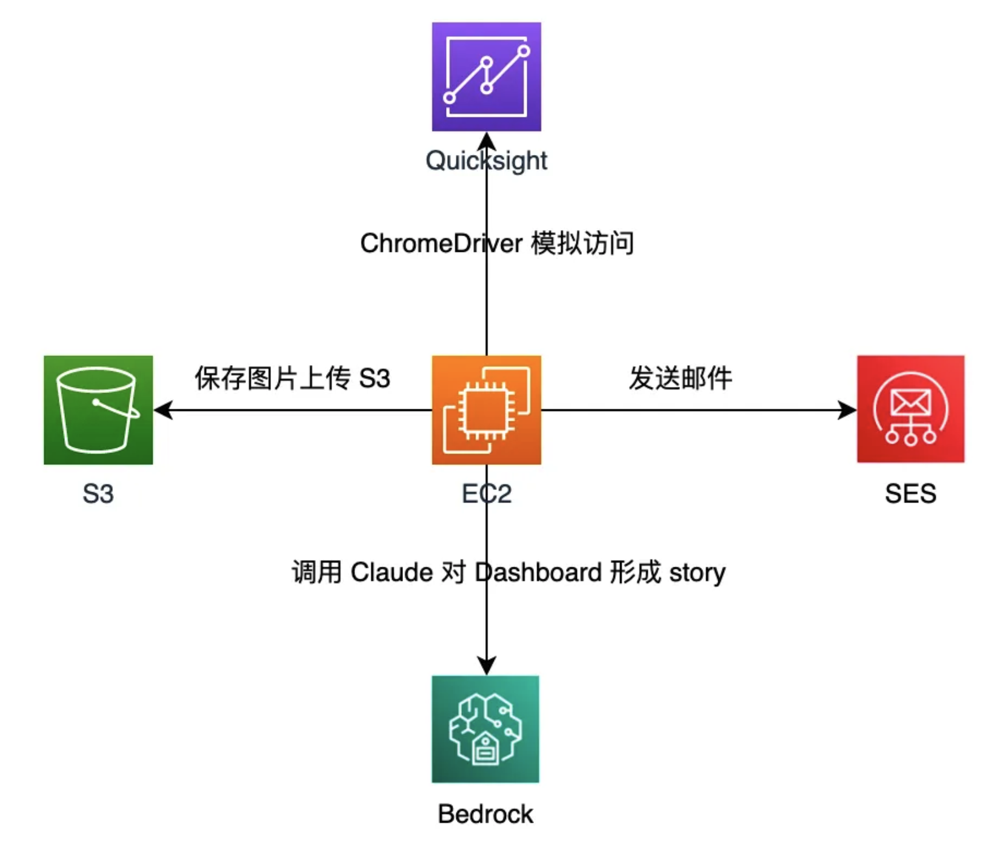

# QuickSight Insight

这是一个用于自动化截取 Amazon QuickSight 仪表板并使用 Claude 进行分析的工具。

## 说明

在当今数据驱动的商业环境中，Amazon QuickSight 作为强大的商业智能(BI)工具，已成为众多企业进行数据可视化和运营决策的重要支撑。通过 QuickSight，我们能够构建丰富的数据仪表板，为业务运营提供直观的数据支持。

然而，在实际应用过程中，我们发现现有的自动化报表推送存在一定局限性。QuickSight 的邮件推送功能仅能展示原始数据，缺乏对数据的专业解读和洞察。若完全依赖数据分析师进行人工解读，不仅会造成大量重复性工作，还会面临时效性差、人力成本高等问题。

虽然 Amazon QuickSight 目前支持了 QuickSight Q 以及 基于图标生成 Story 的能力，但由于受限于仅支持英英文，Story功能也只在部分区域提供服务，并且依赖于在 Amazon QuickSight console 上的操作配置，并不能满足所有用户的需求。

为解决这一痛点，本文将介绍一种创新的解决方案：通过将 QuickSight Dashboard 与 Claude 大语言模型相结合，实现数据获取、分析和推送的智能化流程。该方案可以自动捕获指定仪表板的数据，利用 AI 进行初步分析和解读，并通过邮件推送给数据分析师审核。这种半自动化的工作流程既保证了数据分析的专业性，又显著提升了效率，使数据分析师能够将更多精力投入到更具价值的分析工作中。

在接下来的内容中，我们将详细探讨该解决方案的具体实现方法和关键技术点，以期为类似场景提供可参考的技术思路。

##架构


Amazon QuickSight：作为企业级BI分析平台，支持构建高度可视化的业务和运营数据仪表盘，提供直观的数据展示与分析能力。

Amazon EC2：部署自动化脚本服务，通过配置计划任务实现系统各组件间的精确协调与定时执行，确保工作流的可靠运行。

Amazon S3：作为企业级对象存储服务，用于持久化存储仪表盘的图像快照，实现数据的长期归档与快速检索。

Amazon Bedrock：集成Claude大语言模型，对仪表盘图像内容进行智能解析，通过先进的计算机视觉和自然语言处理能力，自动生成专业的数据洞察报告。

Amazon SES：邮件服务，将仪表盘可视化内容与AI生成的分析洞察进行整合，通过规范化的邮件模板实现高效的信息分发。

这一架构通过AWS云服务的无缝集成，实现了从数据可视化、自动化处理到智能分析的端到端工作流，为企业提供了高效的数据驱动决策支持系统。

## 优势

1. 高度可定制的灵活架构
    - 支持企业根据实际业务需求进行精细化配置，包括报表类型、分析维度、收件人群组及推送频率
    - 提供丰富的prompt模板库，可针对不同行业场景快速构建专业的分析框架
2. 智能化的数据解读能力
    - 运用先进的AI技术，将复杂的数据可视化转化为清晰的叙事性分析
    - 提供数据趋势预测与潜在风险预警，支持前瞻性决策制定
    - 智能生成符合业务语境的专业分析报告，降低数据解读门槛
3. 显著的效率提升与价值创造
    - 大幅减少人工数据处理与报告编写时间，提升分析师工作效率
    - 实现数据分析的标准化与规模化，确保分析质量的一致性
    - 加速数据驱动决策流程，提升企业运营效率
4. 强大的数据分析能力
    - 支持跨时间维度的数据对比分析，深入挖掘业务趋势
    - 自动识别异常数据并提供深度分析见解
    - 整合多维度数据，提供全面的业务表现评估


## 效果演示

以下演示为虚拟的测试数据


## 环境要求

- Python 3.7+
- Chrome 浏览器 (用于Selenium截图)
- AWS账号配置 (用于访问AWS服务)

## 安装步骤

1. EC2服务角色权限
 ```
   {
    "Version": "2012-10-17",
    "Statement": [
        {
            "Sid": "S3UploadPermissions",
            "Effect": "Allow",
            "Action": [
                "s3:PutObject",
                "s3:PutObjectAcl"
            ],
            "Resource": "arn:aws:s3:::your-bucket-name/*"
        },
        {
            "Sid": "SESPermissions",
            "Effect": "Allow",
            "Action": [
                "ses:SendEmail",
                "ses:SendRawEmail"
            ],
            "Resource": "*"
        },
        {
            "Sid": "BedrockPermissions",
            "Effect": "Allow",
            "Action": [
                "bedrock:InvokeModel",
                "bedrock:InvokeModelWithResponseStream"
            ],
            "Resource": "*"
        }
    ]
}

 ```

2. 在Quicksight 对应Role上进行STS信任关系配置
```
{
    "Version": "2012-10-17",
    "Statement": [
        {
            "Sid": "sts",
            "Effect": "Allow",
            "Principal": {
                "AWS": "arn:aws:iam::accountid:role/xxxxx"
            },
            "Action": "sts:AssumeRole"
        }
    ]
}
```

3. 安装依赖包：
```bash
pip install -r requirements.txt
```

4. 安装Chrome WebDriver：
   - 确保已安装Chrome浏览器
   - 下载对应版本的ChromeDriver并添加到系统PATH中
   ```
   sudo su
   #下载并安装linux chrome
   wget https://dl.google.com/linux/direct/google-chrome-stable_current_amd64.deb
   yum localinstall google-chrome-stable_current_x86_64.rpm
   google-chrome --version

   #下载chromedirve，注意需要和chrome版本相同
   # https://googlechromelabs.github.io/chrome-for-testing/#stable
   https://storage.googleapis.com/chrome-for-testing-public/131.0.6778.204/linux64/chromedriver-linux64.zip
   mv ./chromedriver-linux64/chromedriver /usr/bin
   chromedriver --version

   #安装pip
   yum install python-pip
   ```

## 目录结构

```
.
├── README.md
├── requirements.txt
├── config.ini
├── main.py                 # 主程序入口
├── img_handler.py          # 图片处理模块
├── claude_handler.py       # Claude API处理模块
├── s3_handler.py          # S3操作模块
├── ses_handler.py         # SES邮件发送模块
├── sts.py                 # AWS STS处理模块
└── output/                # 输出目录
    └── {task_name}/      # 任务输出目录
```

## 配置文件说明

config.ini需要配置以下内容：

```ini
[task]
task = task1,task2  # 要执行的任务列表，用逗号分隔

[task1]
url = https://quicksight.aws.amazon.com/...  # QuickSight仪表板URL
window_size = 1920,1080  # 截图窗口大小
frequency = 24  # 执行频率（小时）
descriptions = 任务1描述  # 任务描述
prompt = 分析该图表并...  # Claude分析提示词

[s3]
bucket = your-bucket  # S3存储桶名称
region = ap-northeast-1  # S3区域

[ses]
region = ap-northeast-1  # SES区域

[bedrock]
region = us-west-2  # Bedrock区域
model_id = anthropic.claude-3-5-sonnet-20241022-v2:0  # Claude模型ID

[iam]
role_arn = arn:aws:iam::...  # IAM角色ARN
```

## 使用方法

1. 配置完成后，直接运行main.py：
```bash
python main.py
```

2. 程序会：
   - 根据配置的任务列表执行截图
   - 使用Claude分析图表内容
   - 通过邮件发送分析结果

## 注意事项

1. 确保AWS账号有足够的权限访问相关服务
2. 建议使用IAM角色或用户进行权限管理
3. 注意配置
